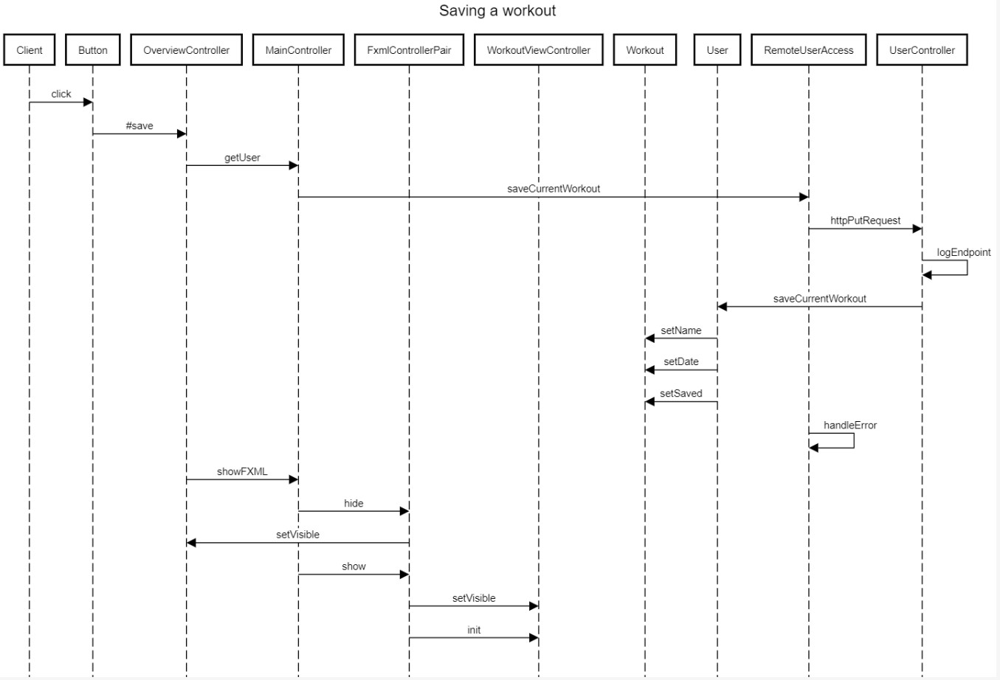
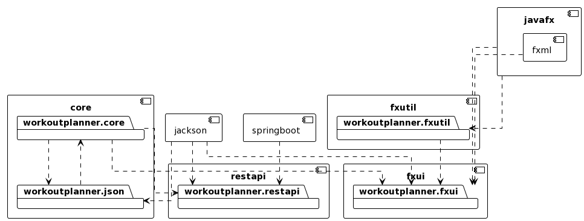

# Diagrams

This markdown shows different diagrams showcasing the app.

## Sequence Diagram

The following sequence diagram shows when the user(here we use Client) clicks the save button to save a workout.

  1. The user starts by clicking a button
  2. The button runs the method `#save` in `OverviewController`. 
  3. The save-method then sends the current workout to `RemoteUserAccess` to create a put-request.
  4. The put-request is a REST call with an URL containing name and save
  5. The `UserController` class receives the call, and updates the `User` object in core as well as logging the endpoint.
  6. `RemoteUserAccess` checks for a responseCode, gives error if not.
  7. Within the `showFXML` method, `MainController` performs actions like hiding the overview and showing the workoutView.

## Package Diagram

The following package diagram shows a representation of the module and package architecture for the workoutplanner app.

The arrows point towards the component which implements it.