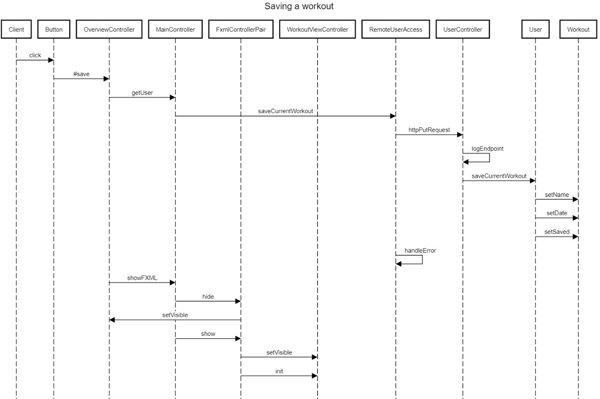

# Diagrams

This markdown shows different diagrams showcasing the app.

## Sequence Diagram

The following sequence diagram shows when the user (here we use Client) clicks the save button to save a workout.

  1. The user starts by clicking a button
  2. The button runs the method `#save` in `OverviewController`. 
  3. The save-method then sends the current workout to `RemoteUserAccess` to create a put-request.
  4. The put-request is a REST call with a URL containing name and save
  5. The `UserController` class receives the call, and updates the `User` object in core as well as logging the endpoint.
  6. `RemoteUserAccess` checks for a responseCode, gives error if not.
  7. Within the `showFXML` method, `MainController` performs actions like hiding the overview and showing the workoutView.

## Package Diagram

The following package diagram shows a representation of the module and package architecture for the workoutplanner app.

The arrows point towards the component which implements it.
For improved readability and relevance, modules like java,
jdk and subcomponents of jackson, springboot and javafx, have been removed from the diagram.
To view a complete version of the diagram, view the PackageDiagramComplete.puml file.

## Class Diagram and Object Diagram

The following object diagram shows the dependencies between the different classes
that are important for the functionality of the program. 

The following class diagrams shows the two core functionalities of the application.

The following class diagram is a combination of the three previous diagrams to show a broader view of the application.
The diagram was split up and shown as three pictures because of readability.

For a full diagram including all classes as well as their dependencies, view the ClassDiagramComplete.puml file.

