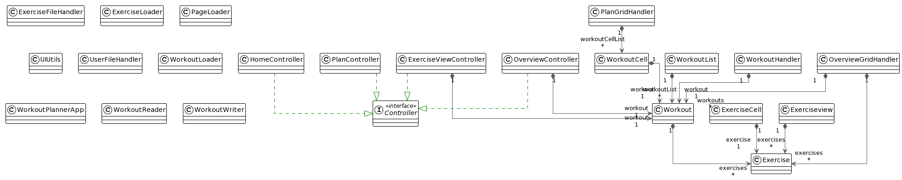

# Release 2

## About the app

Our app now gives you two choices, either to add a workout or visit old workouts. 
When you add a workout, based on different parameters, you get to an overview, where you can view what exercises you have added in a grid. You can then choose to delete the workout or save the workout.
When you delete the workout, you get brought back to the home page, whereas if you press the save button, your workout gets added to a grid of former workouts. You can also customize what the workout should be named by writing in the input field at the top of the overview scene. When you have saved a workout, you get the opportunity to enter former workouts by clicking on the different cells in the grid.

## Focus

### Modularity

In this release, we have proper modularity with a core, fxui and fxutil module, where each module is made according to maven.
We have customized the module-info and pom-files such that the entire project is working together

### Architecture

As mentioned above, we have split the classes into three different modules, where the core only consists of the classes `Exercise` and `Workout`.

### Code quality

We have tests for the different modules, including TestFX in the fxui module. We have added code-coverage via jacoco, where you can see how much of the testing is done.

### Documentation

There is an .md file in each of the modules that explains the classes and what they do. We have focused on working in pairs, on different parts of the modules. For example, did some of us work on the overview, while others worked at planview. We have done it so that spotbugs must be clean for the program to run.
We have also created an object diagram for the code:

