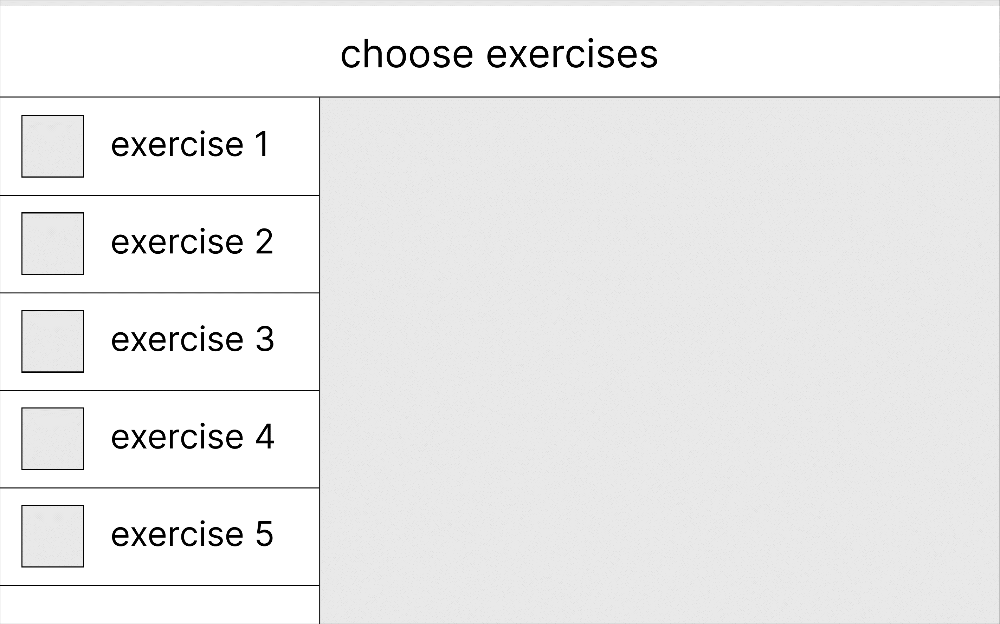
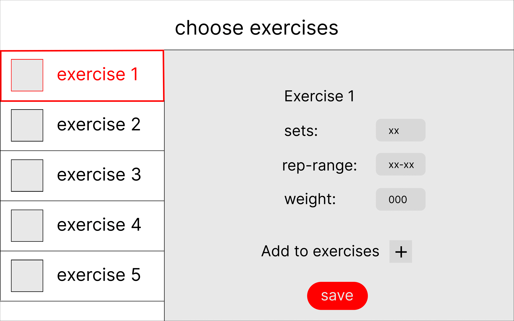
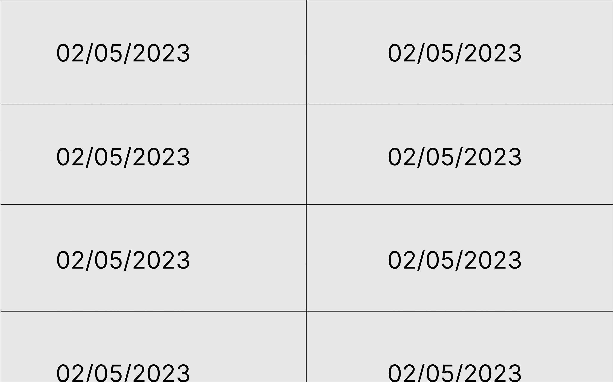

## About the project

This project is a workout planner app made with maven in javafx. It is a school project for the course IT1901 at NTNU. The point of the project is to learn how to work in a group with a continuous integration/development pipeline.

The goal for the app is to be able to have a list of your personal workouts based on specific exercises. The workouts can then be saved and loaded. We want the user to be able to customise sets, rep range and weight, and add multiple exercises to one workout. We want there to be both a preview for the exercises you have selected in a specific workout and a preview of all the workouts with custom name and date.

## Screenshots

