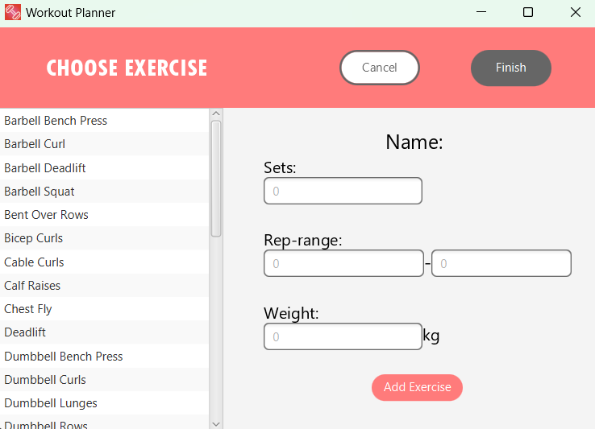
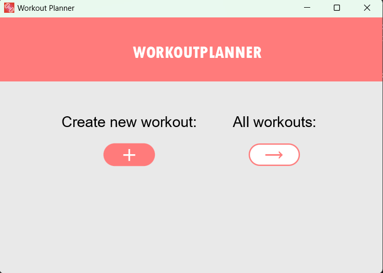

## About the project

This project is a workout planner app made with maven in javafx. It is a school project for the course IT1901 at NTNU. The point of the project is to learn how to work in a group with a continuous integration/development pipeline.

The goal for the app is to be able to have a list of your personal workouts based on specific exercises. The workouts can then be saved and loaded. We want the user to be able to customize sets, rep range and weight, and add multiple exercises to one workout. We want there to be a view of the exercises you have selected for a workout, and a view of all the workouts with custom name and date.
Creating a workout is done in the following screenshot:

After adding the exercises, a `Workout` object is created. This is something that you can edit by deleting exercises or moving the order of an exercise. The exercises in the `Workout` are displayed in the following screenshot:

When you edit a workout, you should be able to add a new workout, or return to the workoutview:

Another part of the app is the overview of workouts, where you get a view of each workout you have created with a corresponding name and date. You also have the option of deleting a workout, or edit by clicking `view`:

The app works with persistence and backend, making it so that workouts get saved after using the app.

## Screenshots

